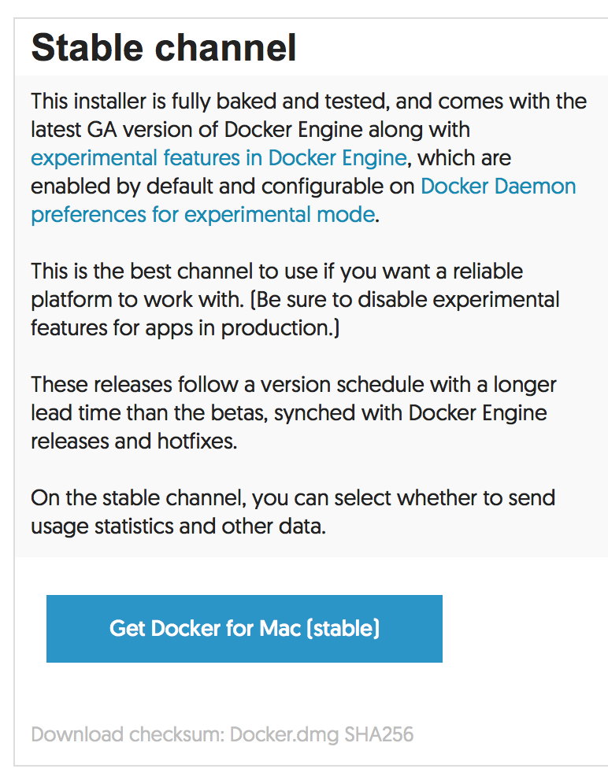
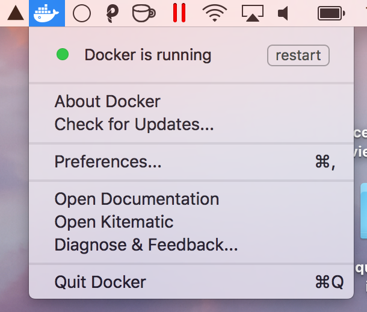

# Installation & Setup

## Installing Docker for Mac

Installing Docker on a mac couldn't be easier. Go to <https://docs.docker.com/docker-for-mac/> and click on the download button pictured below.



Open the installer and follow the prompts.  Once complete you should see the docker 🐳 in your menu bar.



## Testing your Docker installation

Now that you have install Docker and have it running on your machine, lets try it out.

Lets first try out the docker CLI to make sure the daemon is running and everything is hooked up properly. Open Terminal and run `docker ps`. This command lists all running containers.  You shouldn't have any running yet so you should just get back an empty list like the snippet below.

```
$ docker ps
CONTAINER ID        IMAGE               COMMAND             CREATED             STATUS              PORTS               NAMES
```

If you got an error instead, visit <https://docs.docker.com/docker-for-mac/troubleshoot/> for troubleshooting information.

Now, let's try pulling and running a docker image.  Let's run the `hello-world` image (<https://hub.docker.com/_/hello-world/>).  This image spits out a message and exits.  To run the image run `docker run hello-world`.

You should see the output smiler to the following:

```
Hello from Docker!
This message shows that your installation appears to be working correctly.

To generate this message, Docker took the following steps:
 1. The Docker client contacted the Docker daemon.
 2. The Docker daemon pulled the "hello-world" image from the Docker Hub.
 3. The Docker daemon created a new container from that image which runs the
    executable that produces the output you are currently reading.
 4. The Docker daemon streamed that output to the Docker client, which sent it
    to your terminal.

To try something more ambitious, you can run an Ubuntu container with:
 $ docker run -it ubuntu bash

Share images, automate workflows, and more with a free Docker ID:
 https://cloud.docker.com/

For more examples and ideas, visit:
 https://docs.docker.com/engine/userguide/
````

Since we have not yet pulled that image, docker automatically pulled it for us and then ran it.  We can see that image now by running `docker images`.

```
$ docker images
REPOSITORY                      TAG                 IMAGE ID            CREATED             SIZE
hello-world                     latest              48b5124b2768        3 weeks ago         1.84 kB
```

## Running a Web Server


## Using `docker-proxy`


Continue to [Docker CLI &rarr;](docker-cli)
