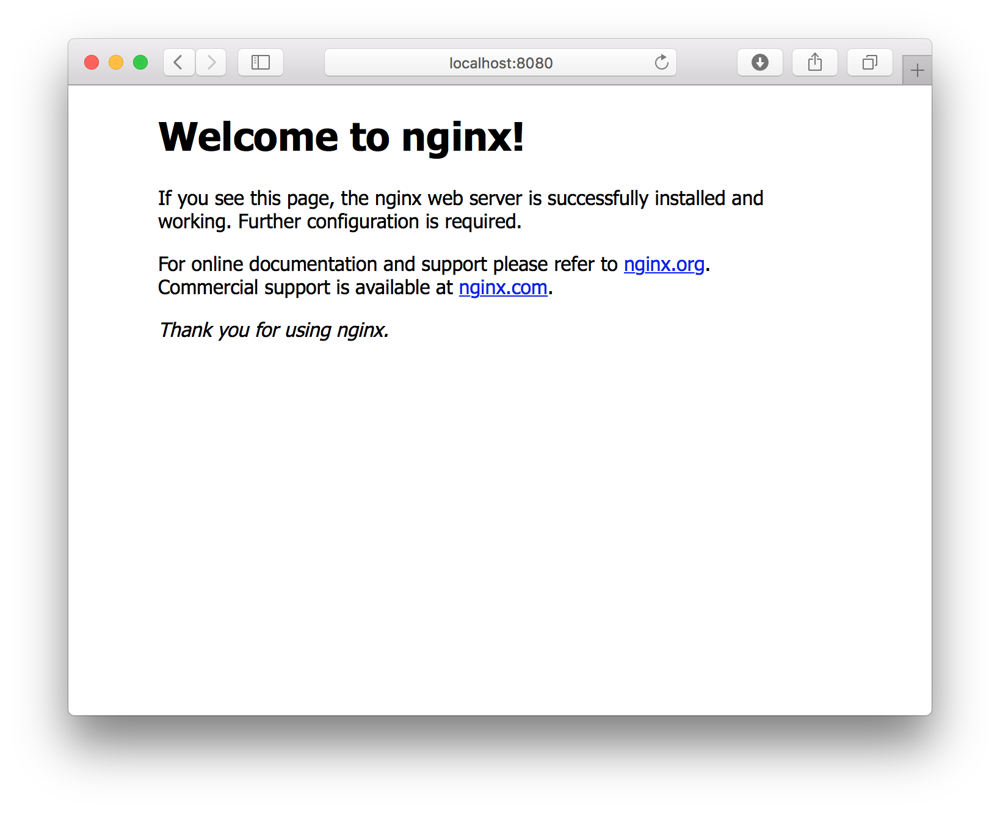

# Installation & Setup

## Installing Docker for Mac

Installing Docker on a mac couldn't be easier. Go to <https://docs.docker.com/docker-for-mac/> and click on the download button pictured below.


Open the installer and follow the prompts.  Once complete you should see the docker 🐳 in your menu bar.


## Testing your Docker installation

Now that you have install Docker and have it running on your machine, lets try it out.

Lets first try out the docker CLI to make sure the daemon is running and everything is hooked up properly. Open Terminal and run `docker ps`. This command lists all running containers.  You shouldn't have any running yet so you should just get back an empty list like the snippet below.

```
$ docker ps
CONTAINER ID        IMAGE               COMMAND             CREATED             STATUS              PORTS               NAMES
```

If you got an error instead, visit <https://docs.docker.com/docker-for-mac/troubleshoot/> for troubleshooting information.

Now, let's try pulling and running a docker image.  Let's run the `hello-world` image (<https://hub.docker.com/_/hello-world/>).  This image spits out a message and exits.  To run the image run `docker run hello-world`.

You should see the output smiler to the following:

```
Hello from Docker!
This message shows that your installation appears to be working correctly.

To generate this message, Docker took the following steps:
 1. The Docker client contacted the Docker daemon.
 2. The Docker daemon pulled the "hello-world" image from the Docker Hub.
 3. The Docker daemon created a new container from that image which runs the
    executable that produces the output you are currently reading.
 4. The Docker daemon streamed that output to the Docker client, which sent it
    to your terminal.

To try something more ambitious, you can run an Ubuntu container with:
 $ docker run -it ubuntu bash

Share images, automate workflows, and more with a free Docker ID:
 https://cloud.docker.com/

For more examples and ideas, visit:
 https://docs.docker.com/engine/userguide/
````

Since we have not yet pulled that image, docker automatically pulled it for us and then ran it.  We can see that image now by running `docker images`.

```
$ docker images
REPOSITORY                      TAG                 IMAGE ID            CREATED             SIZE
hello-world                     latest              48b5124b2768        3 weeks ago         1.84 kB
```

## Running a Web Server

Now that we figured out how to pull and run an image, let's run a web server and hit it from our browser.  To keep this example simple, let's use the official `nginx` image (<https://hub.docker.com/_/nginx/>).

Here's the command: `docker run -p 8080:80 -d nginx`

Let me explain what these new flags are.  The `-p` flag, as you may have guessed, binds a container port to your host machines port.  In the example above we are binding our local port `8080` to port `80` inside the container.  The `-d` flag stands for daemonize.  This flag just forces the container to run in the background.

Since we daemonized this container the only output we should see is the image being pulled.  Once that is complete, we can check to see the container is running with the `docker ps` command.

```
$ docker ps
CONTAINER ID        IMAGE               COMMAND                  CREATED             STATUS              PORTS                           NAMES
6490b43f85ee        nginx               "nginx -g 'daemon ..."   About an hour ago   Up 3 seconds        443/tcp, 0.0.0.0:8080->80/tcp   hardcore_curie
```

As we can see the `STATUS` of the container is `Up`.  Let's see if we can hit it in our browser.  <http://localhost:8080>



## Using `docker-proxy`

Already it should be apparent that docker could be a super time saver for developers, but this is just the surface.  Just wait till we get to Docker Compose.  Before we move on, however, let's setup one more thing.

Binding ports in docker, as you saw, is very simple, however it can become hard to manage when your project contains several apps, and then harder when you need to run several different projects.  Each port can only be bound to one container, so port collisions are a problem.  To avoid this problem we can let docker choose a random unused port for us, but then we need to query for the port often.  The way I manage it is with [codekitchen](https://github.com/codekitchen)'s http-proxy image.  The container runs a dns server and an http proxy to route hostnames to the proper container.  Let's just set it up for now and I'll show you an example later.

I created a simple shell script to help manage the process <https://github.com/aj-may/docker-proxy>.  I recommend following that URL and reading the docs.  To install, simply run the command below:

```
(cd /usr/local/bin; curl -sL https://raw.githubusercontent.com/aj-may/docker-proxy/master/install.sh | sudo bash)
```

Once installed you can run the script with `docker-proxy`.  Without providing any arguments it will just spit out the usage information.

```
$ docker-proxy

docker-proxy 1.0.0.

Usage:
  docker-proxy status      Prints the status of the docker proxy.
  docker-proxy start       Starts the docker proxy.
  docker-proxy stop        Stops the docker proxy.
  docker-proxy restart     Restarts the docker proxy.
  docker-proxy update      Pulls the latest image for the docker proxy container.
  docker-proxy help        Show this message.
  docker-proxy version     Print the version number.
```

Continue to [Docker CLI &rarr;](docker-cli)
